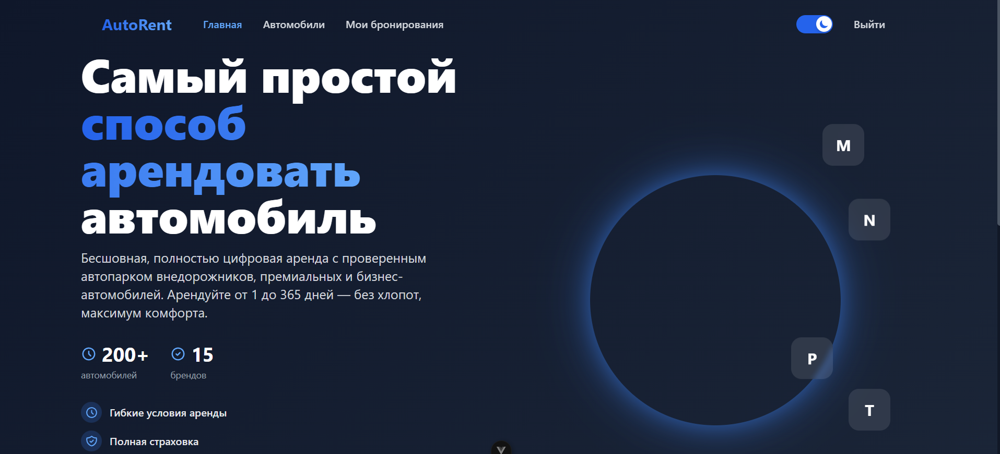
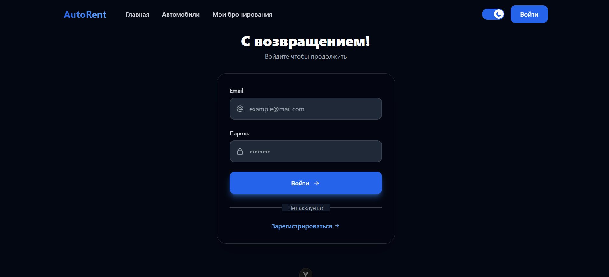
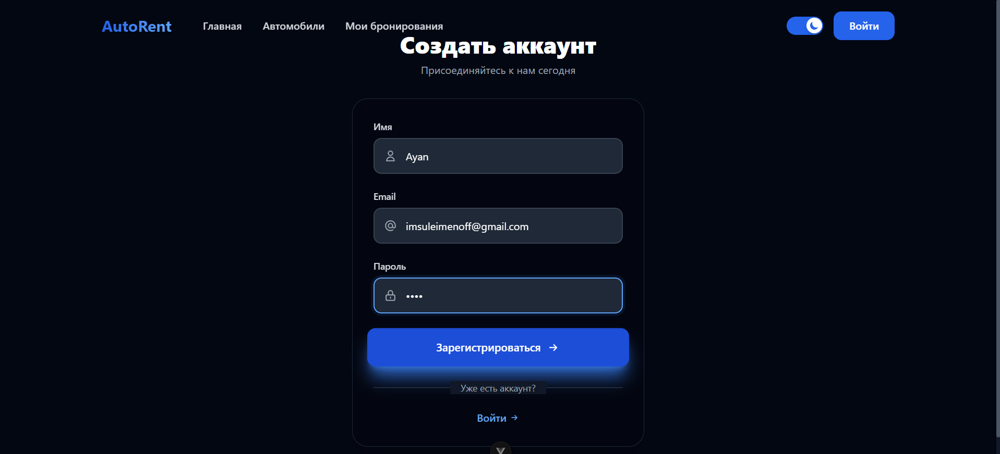
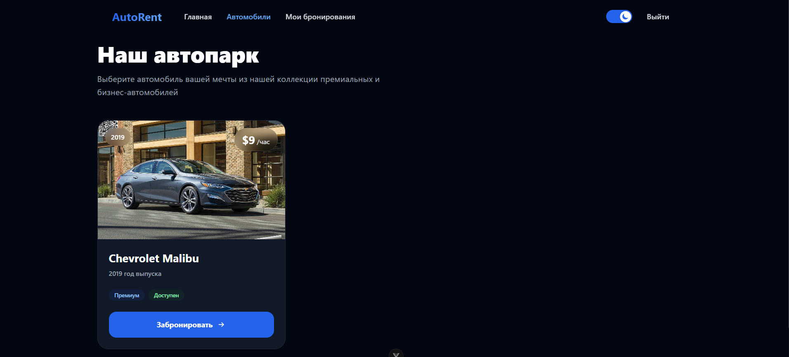
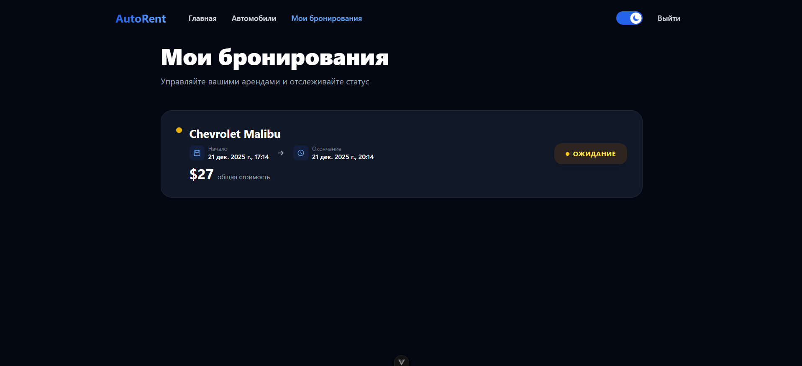
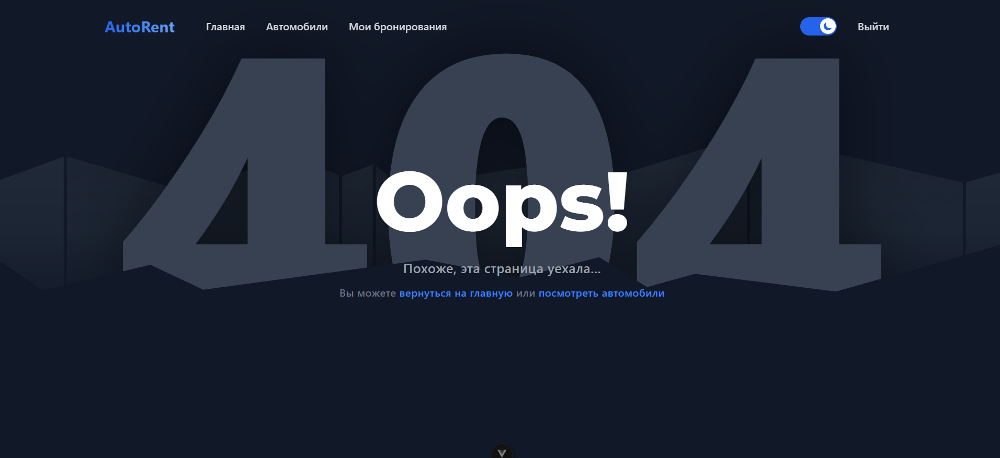

# 📄 **README.md — Autorent Frontend**

# 🚗 Autorent Frontend (Vue 3 + TypeScript)

Фронтенд-приложение для сервиса аренды автомобилей **Autorent**.
Построено на основе:

- **Vue 3**
- **TypeScript**
- **Vite**
- **Tailwind CSS v3**
- **Axios**
- **JWT Authentication**

Приложение использует API из [backend-проекта Autorent](https://github.com/Arlan-Z/autorent-frontend) и предоставляет удобный UI для авторизации, просмотра машин, бронирований и управления учетной записью.

---

# 📸 Скриншоты

### 🏠 Главная страница (Hero Section)



### 🔐 Страница авторизации



### 📝 Страница регистрации



### 🚘 Список машин



### 📅 Мои бронирования



### 🕳️ 404 page



---

# 📦 Установка и запуск

## 1. Клонирование репозитория

```bash
git clone https://github.com/Arlan-Z/autorent-frontend
cd autorent-frontend
```

## 2. Установка зависимостей

```bash
npm install
```

## 3. Запуск в режиме разработки

```bash
npm run dev
```

По умолчанию:
👉 [http://localhost:5173](http://localhost:5173)

---

# 🗂 Структура проекта

```
src/
  api/
    axios.ts       — глобальный клиент Axios
    auth.ts        — запросы авторизации
    cars.ts        — запросы машин
    booking.ts     — запросы бронирований

  components/
    Navbar.vue

  views/
    LoginView.vue
    RegisterView.vue
    CarsView.vue
    MyBookingsView.vue

  router/
    index.ts       — маршрутизация, защита роутов

  store/
    auth.ts        — реактивное хранилище токена

  types/
    Car.ts
    Booking.ts

  assets/
    main.css       — Tailwind
  composables/
    useTheme.ts         — управление темой
    useToast.ts         — система уведомлений
    useMousePosition.ts — отслеживание курсора

  components/
    ThemeToggle.vue      — переключатель темы
    MouseGlow.vue        — эффект свечения
    ToastContainer.vue   — контейнер уведомлений
    ToastItem.vue        — отдельное уведомление

  views/
    HomeView.vue         — главная с hero section
    NotFoundView.vue     — 404 с параллакс эффектом
```

---

# 🔧 Основной функционал

### ✔ Авторизация

- вход по email + пароль
- регистрация нового пользователя
- токен сохраняется в хранилище

### ✔ Просмотр автомобилей

- сетка карточек
- изображение, бренд, модель, цена
- кнопка “Забронировать”

### ✔ Бронирование автомобилей

- создаётся бронь на текущие 3 часа (демо)
- запрос отправляется с JWT

### ✔ Просмотр своих бронирований

- список всех броней пользователя
- бренд, модель, время, статус

### ✔ Навигация

- красивый Navbar
- logout
- скрывается, если пользователь не авторизован

# ✨ Дополнительные фичи (v2.0)

### 🎨 Premium дизайн

- Navy Blue цветовая схема (#1e40af)
- Mouse Glow — синее свечение за курсором
- Glass morphism эффекты
- Премиум карточки с hover анимациями
- Градиенты и glow эффекты

### 🔔 Toast уведомления

- 4 типа: success, error, warning, info
- Автоматическое закрытие через 3-4 сек
- Плавные анимации появления/исчезновения
- Замена стандартных alert()

### 🌓 Тёмная тема

- Переключатель в navbar
- Сохранение в localStorage
- Поддержка на всех страницах

### 🏠 Hero Section

- Главная страница с впечатляющим дизайном
- Статистика (200+ cars, 15 brands)
- Features с иконками
- Premium CTA кнопка

### 🚗 404 страница

- Параллакс эффект с машинками
- 7 слоёв для 3D эффекта
- Машинки следуют за курсором
- Ссылки на главную и каталог
